# Codelabs  #11 | Pemrograman Asynchronous

> **Nama Praktikan:** DAMAR GALIH FITRIANTO  
> **Kelas / NIM:**  3G & 2341720200  
> **Mata Kuliah:** Pemrograman Mobile
---
> **Dosen Pengampu:** Habibie Ed Dien

---

## Praktikum 1

Soal no 2

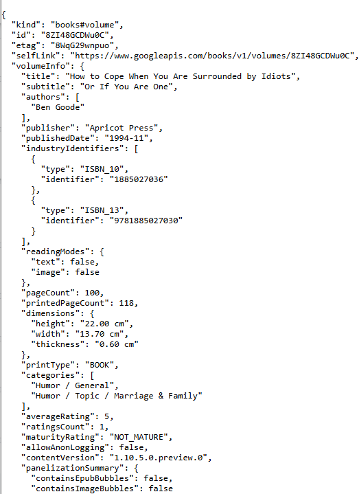

Langkah 5: Tambah kode di ElevatedButton
Tambahkan kode pada onPressed di ElevatedButton seperti berikut.
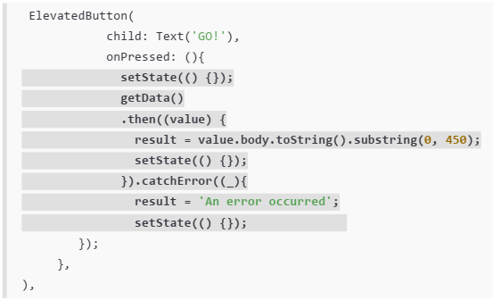

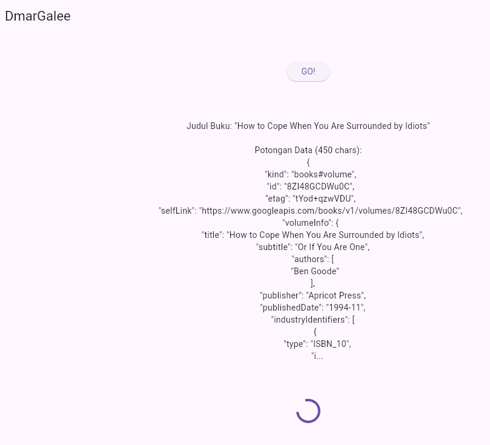

Soal no 3
Jelaskan maksud kode langkah 5 tersebut terkait substring dan catchError!

Tujuan substring(0, 450): Sesuai gambar, tujuannya adalah untuk menampilkan hanya 450 karakter pertama dari data respons API. Ini mungkin dilakukan untuk:

- Mempercepat tampilan: Mengurangi jumlah teks yang perlu dirender di UI.
- Menghindari overflow: Jika result ditampilkan di area teks terbatas, ini mencegah teks yang terlalu panjang meluber.

.catchError() akan dieksekusi ketika Future dari getData() gagal. Kegagalan ini bisa terjadi karena berbagai alasan, seperti:

- Tidak ada koneksi internet.
- Server tidak merespons (timeout).
- URL salah atau tidak valid.
- Error jaringan lainnya.

## Praktikum 2: Menggunakan await/async untuk menghindari callbacks

Langkah 1: Buka file main.dart
Tambahkan tiga method berisi kode seperti berikut di dalam class _FuturePageState.

Future<int> returnOneAsync() async {
  await Future.delayed(const Duration(seconds: 3));
  return 1;
}

Future<int> returnTwoAsync() async {
  await Future.delayed(const Duration(seconds: 3));
  return 2;
}

Future<int> returnThreeAsync() async {
  await Future.delayed(const Duration(seconds: 3));
  return 3;
}

Langkah 2: Tambah method count()
Lalu tambahkan lagi method ini di bawah ketiga method sebelumnya.

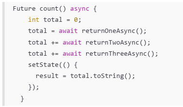

Langkah 3: Panggil count()
Lakukan comment kode sebelumnya, ubah isi kode onPressed() menjadi seperti berikut.

Langkah 4: Run
Akhirnya, run atau tekan F5 jika aplikasi belum running. Maka Anda akan melihat seperti gambar berikut, hasil angka 6 akan tampil setelah delay 9 detik.

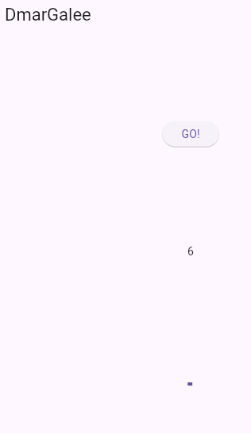

Soal 4
Jelaskan maksud kode langkah 1 dan 2 tersebut!

- Langkah 1: Menambahkan Tiga Metode Asinkron (returnOneAsync, returnTwoAsync, returnThreeAsync)
Tujuan: Untuk membuat tiga simulasi operasi yang membutuhkan waktu tunggu (seperti mengakses API, membaca file, atau operasi I/O lainnya), dan masing-masing mengembalikan nilai integer yang berbeda.

- Langkah 2: Menambahkan Metode Kombinasi (count())
Tujuan: Untuk mendemonstrasikan cara menggabungkan dan menjalankan beberapa operasi asinkron secara berurutan (sequential) menggunakan await.

## Praktikum 3: Menggunakan Completer di Future

Langkah 1: Buka main.dart
Pastikan telah impor package async berikut.

import 'package:async/async.dart';

Langkah 2: Tambahkan variabel dan method
Tambahkan variabel late dan method di class _FuturePageState seperti ini.

late Completer completer;

Future getNumber() {
  completer = Completer<int>();
  calculate();
  return completer.future;
}

Future calculate() async {
  await Future.delayed(const Duration(seconds : 5));
  completer.complete(42);
}

Langkah 3: Ganti isi kode onPressed()
Tambahkan kode berikut pada fungsi onPressed(). Kode sebelumnya bisa Anda comment.

Langkah 4:
Terakhir, run atau tekan F5 untuk melihat hasilnya jika memang belum running. Bisa juga lakukan hot restart jika aplikasi sudah running. Maka hasilnya akan seperti gambar berikut ini. Setelah 5 detik, maka angka 42 akan tampil.

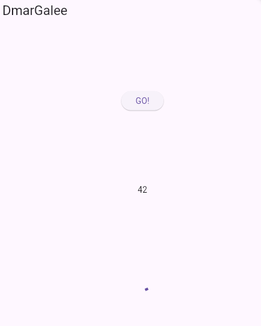

Soal 5
Jelaskan maksud kode langkah 2 tersebut!

1. late Completer completer;
Completer: Ini adalah objek khusus di Dart yang memungkinkan Anda untuk membuat sebuah Future dan, yang paling penting, mengendalikan kapan Future tersebut akan selesai (berhasil atau gagal).

- late: Karena completer adalah state yang terkait dengan _FuturePageState, dan ia diinisialisasi di dalam metode getNumber(), kita menandainya dengan late. Ini berarti kita berjanji bahwa variabel ini pasti akan diinisialisasi sebelum digunakan pertama kali.

2. Future getNumber() { ... }
Metode ini adalah API yang akan dipanggil oleh widget (yaitu, oleh onPressed pada ElevatedButton). Fungsinya adalah untuk memulai proses asinkron dan memberikan Future kepada pemanggil.

completer = Completer<int>();:

- Setiap kali getNumber() dipanggil, ia membuat instance Completer yang baru.

- Completer<int> menandakan bahwa Future yang terkait dengan objek ini (yang akan diselesaikan nanti) akan menghasilkan nilai bertipe int (integer).

calculate();:

- Ini adalah panggilan sinkron (langsung) ke metode calculate(). getNumber() tidak menunggu calculate() selesai; ia hanya memicu pekerjaan tersebut untuk berjalan secara asinkron di latar belakang.

return completer.future;:

- Ini adalah bagian kunci. Metode ini segera mengembalikan objek Future yang terkait dengan Completer yang baru dibuat.

- Future ini pada awalnya belum selesai (uncompleted). Pemanggil (onPressed) dapat mendaftarkan callback (.then()) pada Future ini, tetapi callback tersebut baru akan dieksekusi setelah Completer diselesaikan secara manual oleh metode lain (yaitu calculate()).

3. Future calculate() async { ... }
Metode ini mewakili proses kerja asinkron yang sebenarnya, dan bertanggung jawab untuk menyelesaikan Future.

await Future.delayed(const Duration(seconds : 5));:

- Ini mensimulasikan pekerjaan yang membutuhkan waktu 5 detik (misalnya, mengambil data dari database yang lambat). Eksekusi metode calculate() akan dijeda selama 5 detik.

completer.complete(42);:

- Setelah 5 detik berlalu dan "pekerjaan" selesai, baris ini dieksekusi.

- Metode complete() adalah mekanisme di mana Completer secara eksplisit menyelesaikan Future yang telah dikembalikan oleh getNumber().

- Nilai 42 yang dilewatkan ke complete() akan menjadi nilai yang diterima oleh blok .then((value) => ...) di tempat getNumber() dipanggil.

Langkah 5: Ganti method calculate()
Gantilah isi code method calculate() seperti kode berikut, atau Anda dapat membuat calculate2()

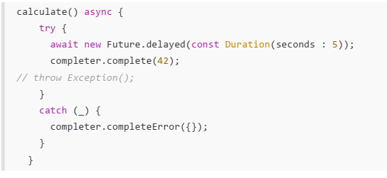

Langkah 6: Pindah ke onPressed()
Ganti menjadi kode seperti berikut.

getNumber().then((value) {
  setState(() {
    result = value.toString();
  });
}).catchError((e) {
  result = 'An error occurred';
});

Soal 6
Jelaskan maksud perbedaan kode langkah 2 dengan langkah 5-6 tersebut!

1. Fokus Langkah 2: Eksekusi Berurutan (count() dengan await)
Kode pada Langkah 2 (pembuatan fungsi count()) fokus pada eksekusi Future secara berurutan (sequential) dan menggunakan await untuk mendapatkan hasil nilai di dalam fungsi async.

2. Fokus Langkah 5 & 6: Kontrol Penyelesaian dan Penanganan Error Manual (Completer)
Kode pada Langkah 5 dan 6 (modifikasi calculate(), getNumber(), dan onPressed) fokus pada kontrol manual penyelesaian Future menggunakan Completer dan penanganan error yang eksplisit menggunakan try-catch dan .catchError().

## Praktikum 4: Memanggil Future secara paralel

Langkah 1: Buka file main.dart
Tambahkan method ini ke dalam class _FuturePageState

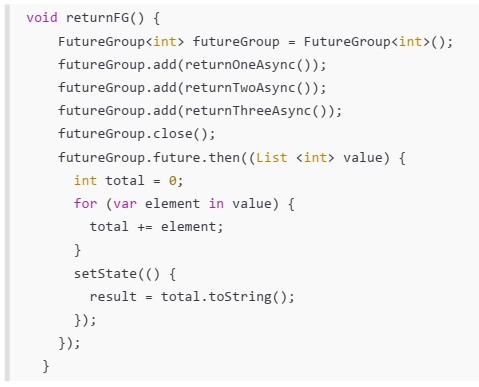

Langkah 2: Edit onPressed()
Anda bisa hapus atau comment kode sebelumnya, kemudian panggil method dari langkah 1 tersebut.

Langkah 3: Run
Anda akan melihat hasilnya dalam 3 detik berupa angka 6 lebih cepat dibandingkan praktikum sebelumnya menunggu sampai 9 detik.

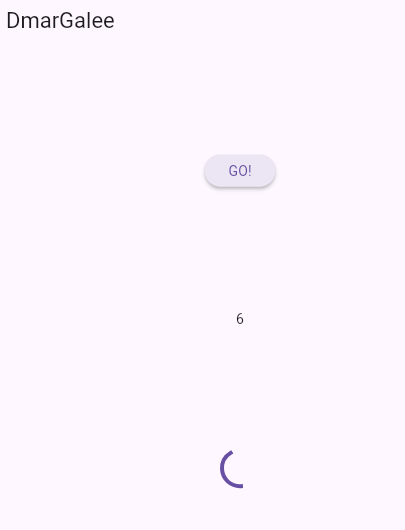

Langkah 4: Ganti variabel futureGroup
Anda dapat menggunakan FutureGroup dengan Future.wait seperti kode berikut.

final futures = Future.wait<int>([
  returnOneAsync(),
  returnTwoAsync(),
  returnThreeAsync(),
]);

Soal 8
Jelaskan maksud perbedaan kode langkah 1 dan 4!

Kedua langkah tersebut menghasilkan hasil yang sama (total 6 dalam waktu 3 detik), tetapi Langkah 4 dengan Future.wait() adalah solusi yang lebih bersih, standar, dan direkomendasikan daripada FutureGroup (Langkah 1) untuk skenario penggabungan future yang statis.

## Praktikum 5: Menangani Respon Error pada Async Code

Langkah 1: Buka file main.dart
Tambahkan method ini ke dalam class _FuturePageState

Langkah 2: ElevatedButton
Ganti dengan kode berikut

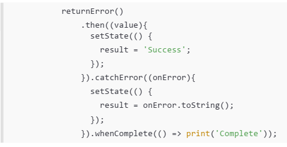

Langkah 3: Run
Lakukan run dan klik tombol GO! maka akan menghasilkan seperti gambar berikut.

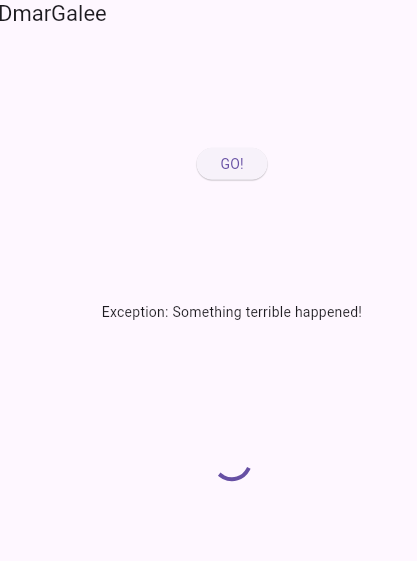

Langkah 4: Tambah method handleError()
Tambahkan kode ini di dalam class _FutureStatePage

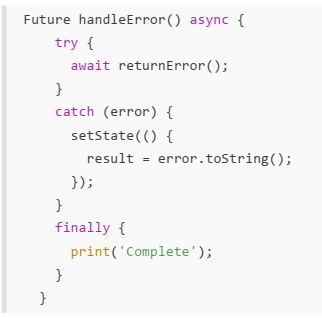

Soal 10
Panggil method handleError() tersebut di ElevatedButton, lalu run. Apa hasilnya? Jelaskan perbedaan kode langkah 1 dan 4!

HASIL

1. Saat Anda menekan tombol "GO!", hasilnya adalah:

2. Aplikasi akan menunggu selama 2 detik (karena await Future.delayed(const Duration(seconds: 2)) di dalam returnError()).

3. Setelah 2 detik, returnError() melempar Exception('Something terrible happened!').

4. Exception ini segera ditangkap oleh blok catch (error) di dalam handleError().

5. Blok catch kemudian memanggil setState() dan memperbarui variabel result dengan pesan error.

6. Variabel result di UI akan menampilkan: Exception: Something terrible happened!

7. Blok finally akan selalu dieksekusi, sehingga pesan Complete akan dicetak ke konsol.

Perbedaan Kode Langkah 1 dan 4 (Praktikum 5)
Perbedaan antara kode pada Langkah 1 dan Langkah 4 adalah dalam cara penanganan error asinkron (Future).

## Praktikum 6: Menggunakan Future dengan StatefulWidget

Langkah 1: install plugin geolocator
Tambahkan plugin geolocator dengan mengetik perintah berikut di terminal.

flutter pub add geolocator

