# stream_gale

A new Flutter project.

## Getting Started

This project is a starting point for a Flutter application.

A few resources to get you started if this is your first Flutter project:

- [Lab: Write your first Flutter app](https://docs.flutter.dev/get-started/codelab)
- [Cookbook: Useful Flutter samples](https://docs.flutter.dev/cookbook)

For help getting started with Flutter development, view the
[online documentation](https://docs.flutter.dev/), which offers tutorials,
samples, guidance on mobile development, and a full API reference.

## Praktikum 1 
Langkah 1: Buat Project Baru

Langkah 2: Buka file main.dart
Ketiklah kode seperti berikut ini.

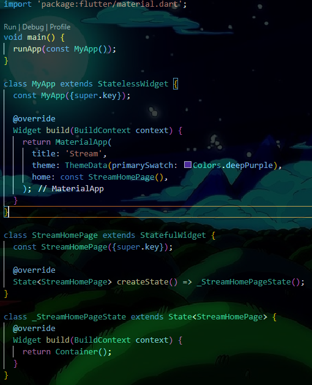

Langkah 3: Buat file baru stream.dart
Buat file baru di folder lib project Anda. Lalu isi dengan kode berikut.

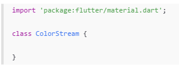

Langkah 4: Tambah variabel colors
Tambahkan variabel di dalam class ColorStream seperti berikut.

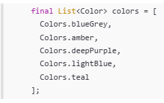

Langkah 5: Tambah method getColors()
Di dalam class ColorStream ketik method seperti kode berikut. Perhatikan tanda bintang di akhir keyword async* (ini digunakan untuk melakukan Stream data)

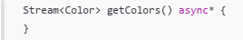

Langkah 6: Tambah perintah yield*
Tambahkan kode berikut ini.

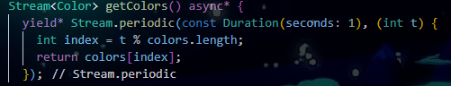

Soal 3
- Jelaskan fungsi keyword yield* pada kode tersebut!
1. Mendelegasikan ke Stream Lain: Fungsi utamanya adalah untuk mendelegasikan semua nilai (event) dari Stream lain langsung ke Stream yang sedang Anda buat.

2. Menyalin dan Meneruskan: Ini seperti mengambil semua event dari Stream di sebelah kanan (Stream.periodic(...)) dan meneruskannya (menambahkan atau "mengeluarkan") satu per satu sebagai event dari Stream yang berada di dalam fungsi generator (async*) saat ini.

yield* adalah cara yang efisien untuk "menggandakan" Stream lain ke dalam Stream Anda tanpa perlu secara manual mendengarkan event dan meneruskannya menggunakan await for.

- Apa maksud isi perintah kode tersebut?

1. Membuat Aliran Data Periodik (Stream)Stream.periodic(...) membuat Stream yang secara teratur mengeluarkan event baru dengan interval waktu tertentu.const Duration(seconds: 1): Menetapkan interval antara setiap event adalah satu detik.

2. Menghitung Nilai Warna(int t): Ini adalah fungsi callback yang dijalankan setiap detik. Argumen t adalah sebuah bilangan bulat yang dimulai dari 0 dan terus bertambah (0, 1, 2, 3, ...).int index = t % colors.length;: Menghitung indeks (index) warna yang akan dikeluarkan. Operator modulo (%) memastikan bahwa indeks akan selalu berada dalam batas panjang list colors. Misalnya, jika colors memiliki 3 elemen (indeks 0, 1, 2), maka:$t=0 \rightarrow 0 \pmod 3 = 0$$t=1 \rightarrow 1 \pmod 3 = 1$$t=2 \rightarrow 2 \pmod 3 = 2$$t=3 \rightarrow 3 \pmod 3 = 0$ (kembali ke awal)return colors[index];: Mengembalikan elemen (Color) dari list colors pada indeks yang dihitung.

Langkah 7: Buka main.dart
Ketik kode impor file ini pada file main.dart

import 'stream.dart';

Langkah 8: Tambah variabel
Ketik dua properti ini di dalam class _StreamHomePageState

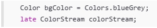

Langkah 9: Tambah method changeColor()
Tetap di file main, Ketik kode seperti berikut

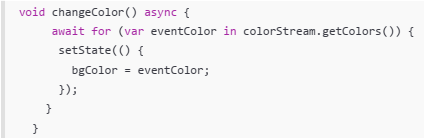

Langkah 10: Lakukan override initState()
Ketika kode seperti berikut

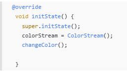

Langkah 11: Ubah isi Scaffold()
Sesuaikan kode seperti berikut.

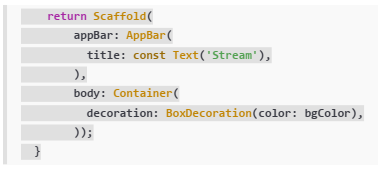

Langkah 12: Run
Lakukan running pada aplikasi Flutter Anda, maka akan terlihat berubah warna background setiap detik.

Langkah 13: Ganti isi method changeColor()
Anda boleh comment atau hapus kode sebelumnya, lalu ketika kode seperti berikut.

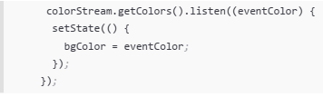

Soal 5
Jelaskan perbedaan menggunakan listen dan await for (langkah 9) !

1. await for

- Cara kerja: Menunggu setiap nilai dari stream secara berurutan (blocking).
- Harus di dalam fungsi async.
- Otomatis selesai ketika stream ditutup (done).
- Cocok untuk stream yang punya akhir (misalnya: baca file, list data).
- Masalah di Flutter: Jika stream tak pernah selesai (seperti timer), initState() akan "hang" selamanya -> tidak aman.

2. .listen()

- Cara kerja: Mendaftar callback, dipanggil setiap ada data baru (non-blocking).
- Tidak perlu async.
- Langganan harus dibatalkan manual dengan StreamSubscription.cancel().
- Cocok untuk stream real-time (timer, sensor, WebSocket).
- Aman di Flutter, asal dibatalkan di dispose().

## Praktikum 2

Langkah 1: Buka file stream.dart
Lakukan impor dengan mengetik kode ini.

import 'dart:async';

Langkah 2: Tambah class NumberStream
Tetap di file stream.dart tambah class baru seperti berikut.

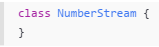

Langkah 3: Tambah StreamController
Di dalam class NumberStream buatlah variabel seperti berikut.

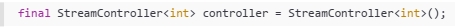

Langkah 4: Tambah method addNumberToSink
Tetap di class NumberStream buatlah method ini

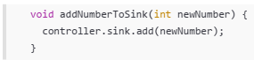

Langkah 5: Tambah method close()

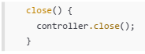

Langkah 6: Buka main.dart
Ketik kode import seperti berikut

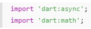

Langkah 7: Tambah variabel
Di dalam class _StreamHomePageState ketik variabel berikut

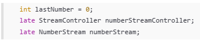

Langkah 8: Edit initState()

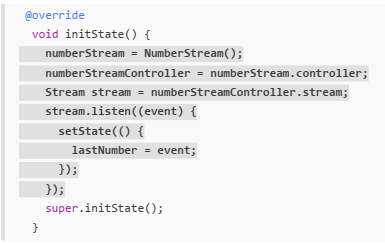

Langkah 9: Edit dispose()

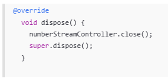

Langkah 10: Tambah method addRandomNumber()

void addRandomNumber() {
  Random random = Random();
  int myNum = random.nextInt(10);
  numberStream.addNumberToSink(myNum);
}

Langkah 11: Edit method build()

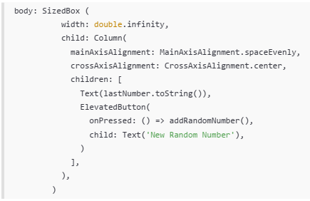

Langkah 12: Run
Lakukan running pada aplikasi Flutter Anda, maka akan terlihat seperti gambar berikut.

Soal 6
Jelaskan maksud kode langkah 8 dan 10 tersebut!

1. numberStream = NumberStream();
numberStreamController = numberStream.controller;

- numberStream = NumberStream();
Membuat objek baru dari kelas NumberStream (yang ada di file stream.dart).
Di dalam kelas NumberStream pasti ada properti controller bertipe StreamController<int>.
- numberStreamController = numberStream.controller;
Menyimpan referensi ke StreamController tersebut ke variabel lokal supaya bisa kita tutup (close) nanti di dispose() dan juga bisa digunakan untuk addError kalau perlu.

2. Method addRandomNumber()

- random.nextInt(10) → menghasilkan angka acak dari 0 sampai 9 (inklusif 0, eksklusif 10).
angka acak yang kita buat dikirim ke dalam stream melalui sink.
Setelah itu, semua yang listen ke stream (yaitu kode di initState tadi) akan langsung menerima angka tersebut.

3. Di dalam dispose()

- close() → menutup StreamController.
Kenapa wajib ditutup?
- Kalau tidak ditutup → terjadi memory leak.
- Flutter akan tetap menyimpan referensi ke stream tersebut meskipun widget sudah dihapus (misalnya saat keluar halaman).
- Bisa menyebabkan crash atau penggunaan memori yang terus naik.

- super.dispose() tetap dipanggil di akhir (kebiasaan baik).

Langkah 13: Buka stream.dart
Tambahkan method berikut ini.

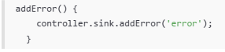

Langkah 14: Buka main.dart
Tambahkan method onError di dalam class StreamHomePageState pada method listen di fungsi initState() seperti berikut ini.

Langkah 15: Edit method addRandomNumber()
Lakukan comment pada dua baris kode berikut, lalu ketik kode seperti berikut ini.

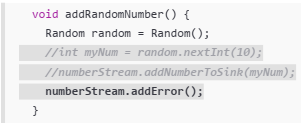

Soal 7
- Jelaskan maksud kode langkah 13 sampai 15 tersebut!
1. addError()

- controller.sink.addError('error') → mengirim objek error (bisa string, Exception, atau custom error) ke stream.

- Tujuannya: mensimulasikan situasi ketika stream mengalami kegagalan (misalnya: gagal ambil data dari internet, input tidak valid, dsb).

2.onError

- Parameter onError adalah callback khusus yang hanya dijalankan ketika stream mengeluarkan error (dari addError()).
- Dengan adanya onError, aplikasi tidak akan crash lagi meskipun ada error di stream.
- Saat error terjadi → lastNumber diubah menjadi -1 → angka di layar berubah jadi -1 sebagai tanda bahwa terjadi kesalahan.

3. Edit method addRandomNumber()

- Sebelumnya: tombol “New Random Number” menghasilkan angka acak 0–9 (normal).
- Sekarang: setiap kali tombol “New Random Number” ditekan → langsung mengirim error ke stream.
- Karena kita sudah menambahkan onError di langkah 14, maka:
Aplikasi tidak crash /  Angka di layar langsung berubah menjadi -1

- Kembalikan kode seperti semula pada Langkah 15, comment addError() agar Anda dapat melanjutkan ke praktikum 3 berikutnya.

## Praktikum 3

Langkah 1: Buka main.dart
Tambahkan variabel baru di dalam class _StreamHomePageState

Langkah 2: Tambahkan kode ini di initState

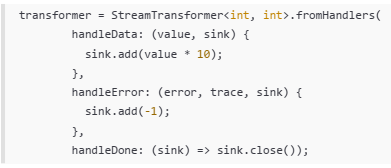

Langkah 3: Tetap di initState
Lakukan edit seperti kode berikut.

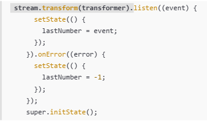

Langkah 4: Run

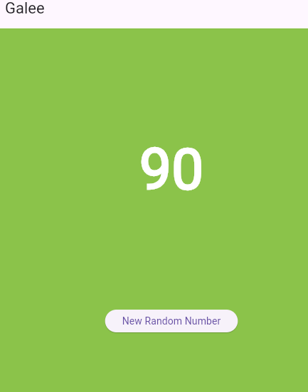

## Praktikum 4

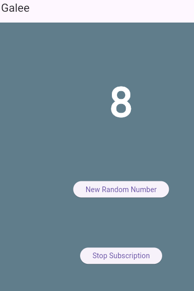

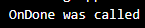

