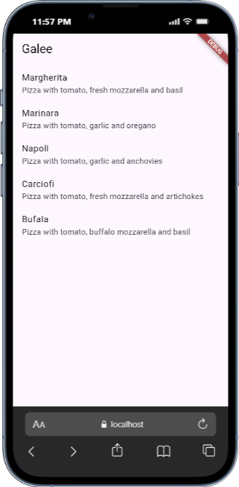
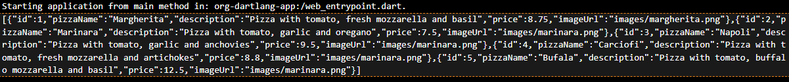
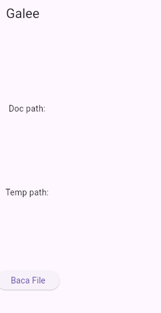
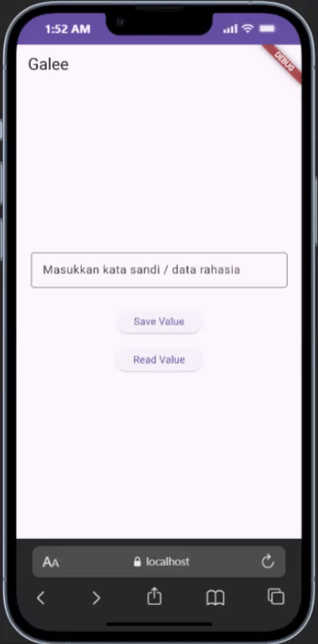

# Codelabs  #13 | Persistensi Data

> **Nama Praktikan:** DAMAR GALIH FITRIANTO  
> **Kelas / NIM:**  3G & 2341720200  
> **Mata Kuliah:** Pemrograman Mobile
---
> **Dosen Pengampu:** Habibie Ed Dien

---
## Praktikum 1

Soal 1

- Tambahkan nama panggilan Anda pada title app sebagai identitas hasil pekerjaan Anda.
- Gantilah warna tema aplikasi sesuai kesukaan Anda.

Soal 2
Masukkan hasil capture layar ke laporan praktikum Anda.

Soal 3

Masukkan hasil capture layar ke laporan praktikum Anda.

## Praktikum 2

Soal 4
Capture hasil running aplikasi Anda, kemudian impor ke laporan praktikum Anda!

## Praktikum 3 

Soal 5
 Jelaskan maksud kode lebih safe dan maintainable!
1. Gunakan konstanta untuk semua key JSON
- Cegah typo, cukup ubah satu tempat kalau server berubah.
2. Pakai initializer list (:) untuk constructor fromJson
- Wajib untuk final field, satu-satunya cara yang benar di Dart modern.
3. Null-safety penuh dengan ?. + ?? + tryParse
- Aplikasi tidak akan pernah crash walaupun server kirim data rusak, null, atau tipe salah (String jadi int, dsb).
4. toJson() juga pakai konstanta yang sama
-  Data yang disimpan / dikirim ke server pasti konsisten 100%.

 Capture hasil praktikum Anda dan lampirkan di README.

.png>)

## Praktikum 4

.png>)

Soal 6
Capture hasil praktikum Anda berupa GIF dan lampirkan di README.

.png>)

## Praktikum 5

Soal 7
Capture hasil praktikum Anda dan lampirkan di README.

.png>)

## Praktikum 6

Soal 8
Jelaskan maksud kode pada langkah 3 dan 7 !
Capture hasil praktikum Anda berupa GIF dan lampirkan di README.

1. Langkah 3: Buat Method writeFile()
- Method ini bertugas menulis teks (Nama Lengkap + NIM kamu) ke dalam file bernama pizzas.txt yang berada di folder dokumen aplikasi.
- myFile.writeAsString(...) → menimpa isi file dengan teks baru (jika file belum ada, otomatis dibuat).
- try … catch digunakan agar jika ada error (misal permission denied, storage penuh, dll), aplikasi tidak crash.
- Mengembalikan true jika berhasil menulis, false jika gagal.
- Tujuannya: menyimpan data secara permanen di penyimpanan internal perangkat (tetap ada meski aplikasi ditutup atau HP dimatikan).

## Praktikum 7

Soal 9
Capture hasil praktikum Anda berupa GIF dan lampirkan di README.

