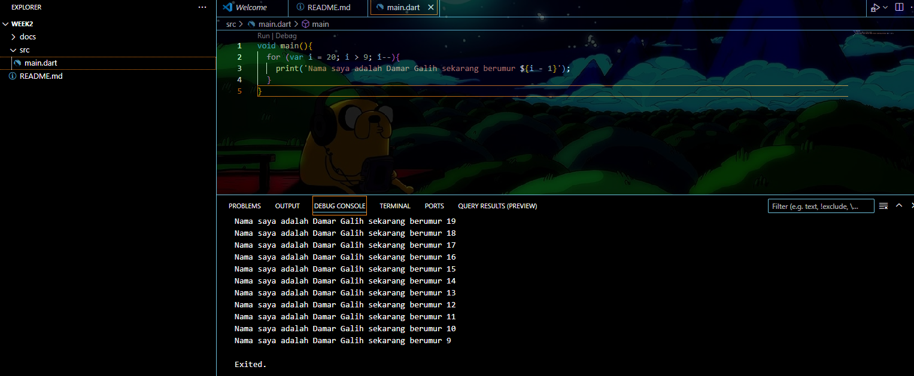
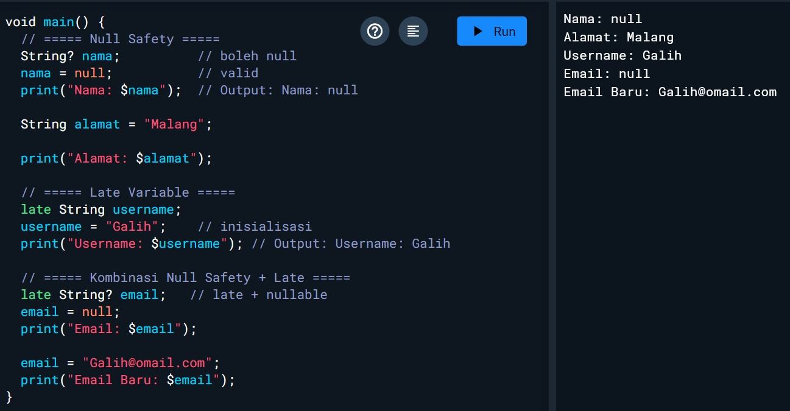

# Pemrograman Mobile Pertemuan 2

Codelabs 2

NIM : 2341720200

NAMA : Damar Galih Fitrianto

Tampilan screenshoot Soal 1

Soal 2
Mengapa sangat penting untuk memahami bahasa pemrograman Dart sebelum kita menggunakan framework Flutter ? Jelaskan!

Flutter dibangun dengan Dart sebagai bahasa utama.
Semua komponen, widget, dan logika aplikasi Flutter ditulis dalam Dart.
Jika belum memahami dasar Dart (variabel, fungsi, class, null safety), akan sulit menguasai Flutter.
Dart menyediakan fitur khusus (seperti async/await, null safety, OOP) yang mendukung performa tinggi di Flutter.
Karena itulah , Dart adalah fondasi, sedangkan Flutter adalah kerangka kerja yang memanfaatkan Dart.

Soal 3
Rangkumlah materi dari codelab ini menjadi poin-poin penting yang dapat Anda gunakan untuk membantu proses pengembangan aplikasi mobile menggunakan framework Flutter.

1. Sintaks & Dasar Dart

Dart memiliki built-in types (int, double, String, bool, dll).
Flow control (if, for, while) dan fungsi mirip bahasa lain.

2. Object-Oriented Programming (OOP)

Dart adalah bahasa berorientasi objek.
Konsep utama: class -> object.

Mendukung prinsip OOP:
Encapsulation (pembungkusan data & method)
Inheritance (pewarisan)
Composition (mengkombinasikan objek)
Abstraction (penyederhanaan konsep)
Polymorphism (satu interface, banyak bentuk)

3. Operator di Dart

Operator di Dart sebenarnya adalah method dalam class dengan sintaks khusus.
Artinya semua data di Dart adalah object, tidak ada tipe primitif seperti di Java.

Kategori Operator:

Arithmetic

+ tambah
- kurang
* kali
/ pembagian  hasil double
~/ pembagian bilangan bulat
% modulus (sisa bagi)

Increment & Decrement
++var / var++  tambah 1
--var / var--  kurang 1

Equality & Relational
== sama dengan
!= tidak sama dengan
> lebih besar
< lebih kecil
>= lebih besar atau sama
<= lebih kecil atau sama

Logical
!expr  negasi (true ↔ false)
||  OR
&&  AND

Soal 4
Buatlah penjelasan dan contoh eksekusi kode tentang perbedaan Null Safety dan Late variabel !

Null Safety (?)  memastikan apakah variabel boleh kosong (null) atau tidak.
Late (late)  menunda pemberian nilai pada variabel, tapi tetap harus diisi sebelum digunakan.

Null Safety (?)
String? nama; artinya variabel boleh bernilai null.
→ saat diisi null, output akan menampilkan Nama: null.

String alamat = "Malang"; tidak boleh bernilai null.
→ jika dicoba alamat = null; akan error.

Late Variable (late)
late String username; artinya variabel belum diberi nilai saat deklarasi, tapi akan diisi nanti.
→ setelah diberi nilai username = "Galih";, output menampilkan Username: Galih.

Kombinasi Late + Null Safety

late String? email; artinya variabel diinisialisasi belakangan dan nilainya boleh null.
→ awalnya diisi null, lalu diperbarui dengan "galih@0mail.com".
→ hasil output:
