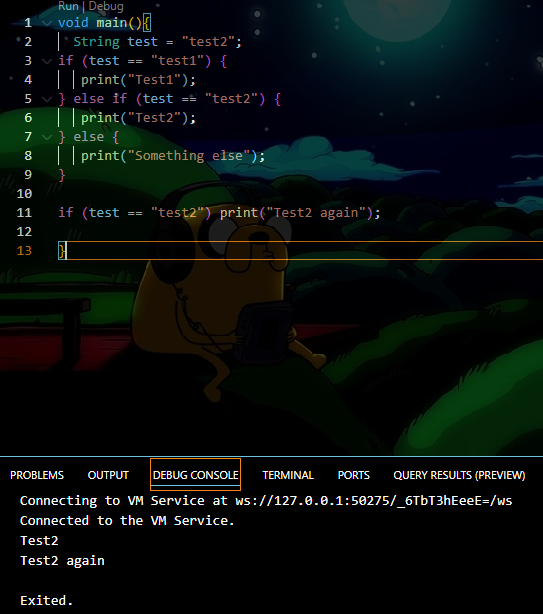

# Pemrograman Mobile Pertemuan 3

Codelabs 3 Pengantar Bahasa Pemrograman Dart - Bagian 2

NIM : 2341720200

NAMA : Damar Galih Fitrianto

Tampilan screenshoot 
Tugas no 1 Silakan selesaikan Praktikum 1 sampai 3, lalu dokumentasikan berupa screenshot hasil pekerjaan beserta penjelasannya!

Praktikum1 kode 1

Setelah memperbaiki kode(Penulisan else if) program mengecek nilai string test menggunakan if, lalu mencetak teks sesuai kondisi.

Praktikum1 kode2

Setelah melakukan pembetulan pada masalah if (test) tidak valid dalam Java karena test adalah tipe String, bukan boolean. Dalam Java, kondisi dalam if harus bertipe boolean (misalnya, true atau false).

Praktikum2 Kode1

Variabel counter tidak dideklarasikan atau diinisialisasi sehingga terjadi error.

Hasil yang benar

Praktikum2 Langkah3

Perulangan while  
while (counter < 33) Perulangan berjalan selama counter kurang dari 33.
print(counter); Mencetak nilai counter.
counter++: Menambah counter sebesar 1.
Hasil Mencetak angka 0 hingga 32.

Perulangan do-while  
do { ... } while (counter < 77); Blok kode dijalankan setidaknya sekali, lalu lanjut selama counter kurang dari 77.
print(counter); Mencetak nilai counter.
counter++: Menambah counter sebesar 1.
Hasil Mencetak angka 33 hingga 76.

Praktikum3 Langkah1

Hasil kode salah dikarenakan variabel Index salah penulisannya dan tidak di deklarasikan, dan increment nya tidak valid.

Kode yang benar!!

Praktikum3 Langkah3

Error terjadi dikarenakan Penulisan If dan Else If yang salah, Variabel Index yang tidak dikenali, break dan continue yang berada di luar loop
dan logika (index > 1 || index < 7) akan selalu true karena index mulai dari 10 (sudah pasti > 1).

Kode yang benar!!   

Tugas no 2 Buatlah sebuah program yang dapat menampilkan bilangan prima dari angka 0 sampai 201 menggunakan Dart. Ketika bilangan prima ditemukan, maka tampilkan nama lengkap dan NIM Anda.

Hasil Screenshot  

Penjelasan kode program

  String nama = "Damar Galih";
  String nim = "2341720200";  
  ##Deklarasi variabel identitas

  for (int i = 0; i <= 201; i++) { ##perulangan dimulai dari 0 hingga 201  
  if (BilPrima(i)) {  ##memanggil fungsi BilPrima untuk mengecek apakah i bilangan prima.
    print("$i -> $nama - $nim");
  }
}  

bool BilPrima(int n) {  
  if (n < 2) return false;  ##bilangan dibawah 2 bukan prima  
  for (int i = 2; i <= n ~/ 2; i++) {  ##pembagi dari 2 sampai separuh nilai n.  
    if (n % i == 0) return false; ##jika habis dibagi i, berarti bukan prima.  
  }
  return true;
} 