# Pemrograman Mobile Pertemuan 4

Codelabs 4 Pengantar Bahasa Pemrograman Dart - Bagian 3

NIM : 2341720200

NAMA : Damar Galih Fitrianto

Tampilan screenshoot 
Tugas no 1 Silakan selesaikan Praktikum 1 sampai 5, lalu dokumentasikan berupa screenshot hasil pekerjaan Anda beserta penjelasannya!

Praktikum1 kode 1
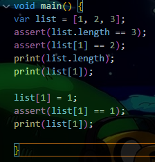

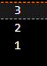

ssert(list.length == 3) → benar, karena list berisi [1,2,3].

assert(list[1] == 2) → benar, karena index ke-1 adalah 2.

print(list.length) → mencetak 3 (jumlah elemen).

print(list[1]) → mencetak 2.

list[1] = 1; → nilai di index ke-1 berubah dari 2 menjadi 1.

assert(list[1] == 1) → benar, karena sudah diubah.

print(list[1]) → mencetak 1.

Ubah kode pada langkah 1 menjadi variabel final yang mempunyai index = 5 dengan default value = null. Isilah nama dan NIM Anda pada elemen index ke-1 dan ke-2. Lalu print dan capture hasilnya.

Praktikum1 kode 2
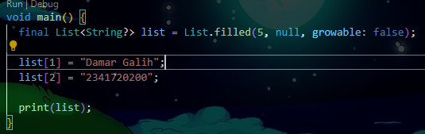

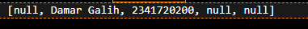

List<String?> → artinya list bisa berisi String atau null.

List.filled(5, null, growable: false) → list memiliki panjang 5, isi awal null.

final → list tidak bisa di-reassign, tapi isi index tetap bisa diubah.

Praktikum2 kode 1
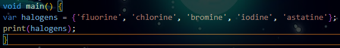

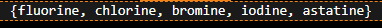

Jadi halogens adalah sebuah Set String`.

Isi set: lima string "fluorine", "chlorine", "bromine", "iodine", "astatine".

Praktikum2 kode 2
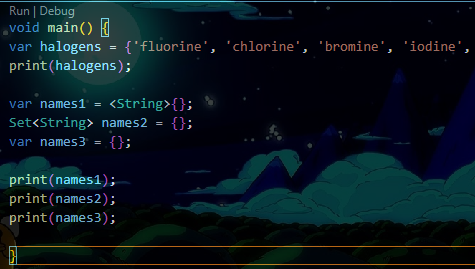

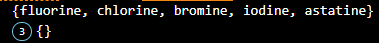

Penambahan Kode

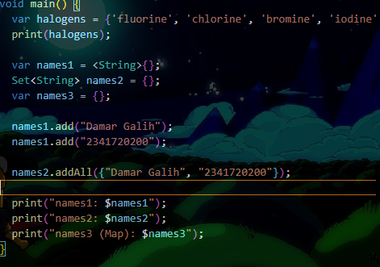
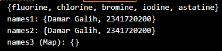

names1 dibuat dengan <String>{}, yaitu Set<String> kosong. Elemen ditambah dengan .add().

names2 juga Set<String> kosong, tapi elemen ditambah dengan .addAll().

names3 otomatis dianggap Map, bukan Set, sehingga hasilnya {}

Praktikum3 kode 1

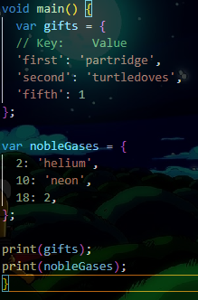
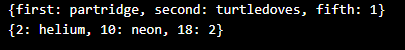

gifts
Dibuat dengan kurung kurawal {}, tapi berbentuk Map<String, dynamic> (karena key berupa String dan value bisa campuran String dan int).

nobleGases
Dibuat dengan key berupa int, value campuran String dan int, jadi tipenya Map<int, dynamic>.

Praktikum3 kode 2

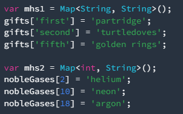

Penambahan kode diatas tidak error tetapi tidak terpakai dikarenakan map kosong.

Penambahan Kode 

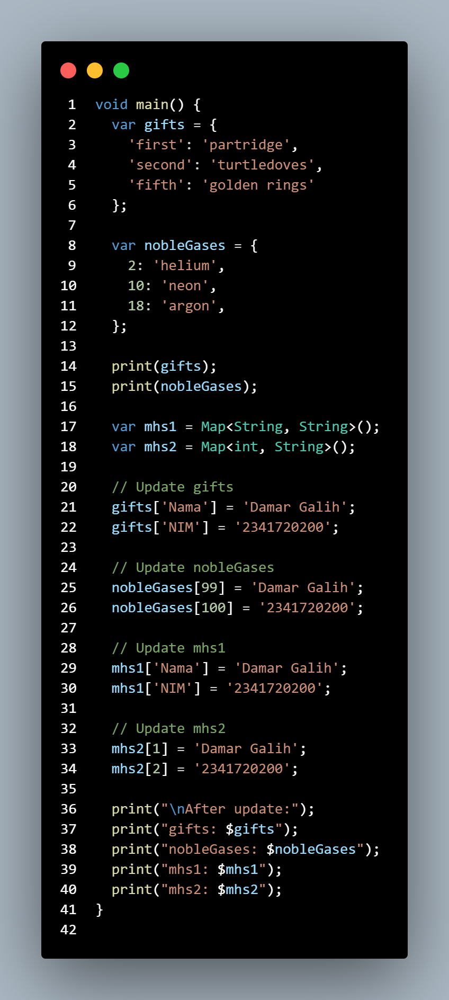
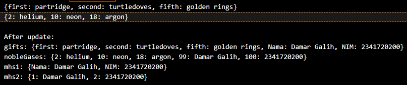

Menambahkan data ke Map

gifts ditambah data baru dengan key "Nama" dan "NIM".
Sekarang gifts punya data tambahan berupa nama dan NIM.

nobleGases ditambah data baru dengan key angka 99 dan 100.
Disimpan nama dan NIM.

mhs1 diisi langsung dengan key "Nama" dan "NIM".
Karena tipenya Map String, String, hanya bisa berisi pasangan string–string.

mhs2 diisi dengan key angka 1 dan 2.
Karena tipenya Map int, String , key angka dan value string.

Praktikum4 kode 1

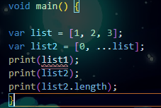

terjadi error dikarenakan variabel list1 tidak pernah dideklarasikan. (yang ada hanya list dan list2.)

Perbaikan Praktikum4 kode 1

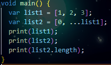

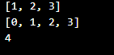

Praktikum4 kode 2

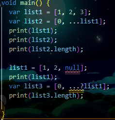

Terjadi error dikarenakan tipe null tidak bisa ditetapkan ke tipe data int.

Perbaikan Praktikum4 kode 2

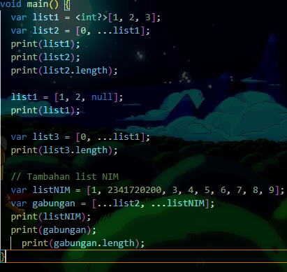
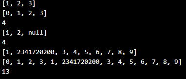

var list1 = <int?>[1, 2, 3];
int? artinya list boleh berisi bilangan bulat atau null.

list1 = [1, 2, null];
Karena sudah int?, list boleh punya null.

var list3 = [0, ...list1];
Spread operator tetap memasukkan semua isi list1.

Praktikum4 kode 3
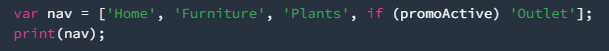

Perbaikan Praktikum4 kode 3
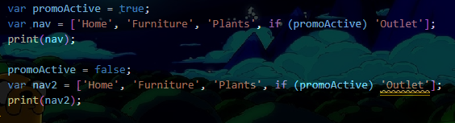

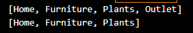

Ketika promActive true 'Outlet' muncul
Ketika promoActive false hanya memunculkan nav saja.

Perbaikan Praktikum4 kode 4
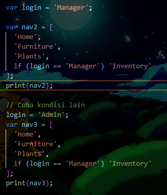

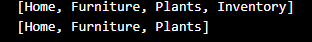

if (...) '...' di dalam list disebut collection if, fitur dari Dart.

== digunakan untuk membandingkan nilai.

"Inventory" hanya muncul jika kondisi benar (login = "Manager").

Praktikum4 kode 5
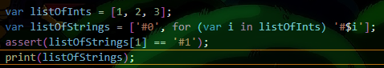

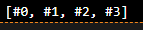

listOfInts = [1, 2, 3]

listOfStrings = ['#0', for (var i in listOfInts) '#$i']

Elemen pertama langsung '#0'.

Lalu collection for akan mengiterasi listOfInts dan menghasilkan '#1', '#2', '#3'.

# Penjelasan for
for loop biasa untuk membangun list.

Bisa langsung menghasilkan list dari iterasi.

Membuat kode lebih deklaratif dan mudah dibaca.

Praktikum5 kode 1
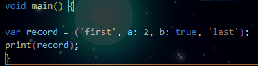

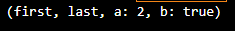

sebenarnya hasil salah dikarenakan kurang titik koma (;).

penjelasan kode
mencetak hasil first yang pertama kemudian a:2, b: pada hasil tengah dan 'last' yang terakhir dikarenakan penempatan var record.

Praktikum5 kode 2
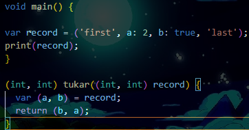

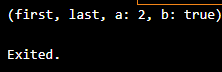

tidak terjadi error.

Perbaikan Praktikum5 kode 2
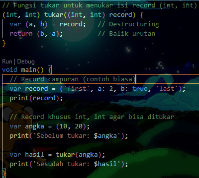

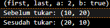

Record adalah tipe data yang bisa menyimpan banyak nilai tanpa harus membuat class.

var (a, b) = record; → disebut destructuring, memecah record ke dalam variabel.

Fungsi tukar() menerima (int, int) lalu menukar posisinya.

Jadi jelas terlihat bahwa (10, 20) ditukar menjadi (20, 10).

Praktikum5 kode 3

Error akan muncul pada bagian print(mahasiswa);
Kenapa? Karena mahasiswa sudah dideklarasikan dengan tipe record (String, int) tapi belum diinisialisasi (belum ada nilai awal).

perbaikan
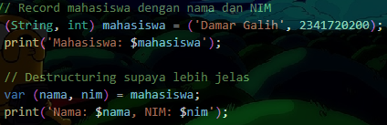

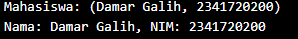

Record (String, int) bisa dipakai untuk menyimpan data sederhana seperti nama & NIM.

Harus diinisialisasi sebelum dipakai, kalau tidak akan error.

Bisa di-destructure ke variabel biasa (var (nama, nim) = mahasiswa;).

Praktikum5 kode 4
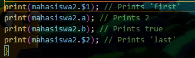

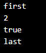

 Gantilah salah satu isi record dengan nama dan NIM Anda

 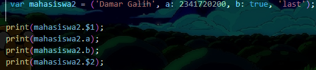

 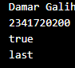

 Record di Dart bisa menyimpan positional ($1, $2) dan named fields (a, b).

 7. Tugas Praktikum

Jelaskan yang dimaksud Functions dalam bahasa Dart!

Functions adalah blok kode yang dapat dipanggil untuk menjalankan tugas tertentu. Fungsinya sama seperti di bahasa pemrograman lain: untuk menghindari duplikasi kode, meningkatkan keterbacaan, dan memudahkan pemeliharaan.

Jelaskan jenis-jenis parameter di Functions beserta contoh sintaksnya!

Positional parameter (wajib, sesuai urutan)
void sapa(String nama, int umur) {
  print("Halo $nama, umurmu $umur tahun");
}

void main() {
  sapa("Damar", 21);
}

b. Optional positional parameter (ditandai dengan [])
void sapa(String nama, [int? umur]) {
  print("Halo $nama, umurmu ${umur ?? 'tidak diketahui'}");
}

void main() {
  sapa("Damar");
  sapa("Damar", 21);
}

c. Named parameter (ditandai {})

Lebih fleksibel karena pemanggil bisa menentukan parameter berdasarkan nama.

void sapa({required String nama, int umur = 0}) {
  print("Halo $nama, umurmu $umur tahun");
}

void main() {
  sapa(nama: "Damar", umur: 21);
  sapa(nama: "Galih"); // umur pakai default = 0
}

Jelaskan maksud Functions sebagai first-class objects beserta contoh sintaknya!

Di Dart, function diperlakukan seperti nilai/data. Artinya, function bisa:

Disimpan dalam variabel

Dikirim sebagai parameter ke function lain

Dikembalikan sebagai hasil function

void halo(String nama) {
  print("Halo $nama");
}

void panggilFunction(void Function(String) func) {
  func("Damar");
}

void main() {
  var f = halo;   // simpan function dalam variabel
  f("Galih");     // panggil lewat variabel

  panggilFunction(halo); // kirim function sebagai argumen
}

Apa itu Anonymous Functions? Jelaskan dan berikan contohnya!

Function tanpa nama, biasanya ditulis langsung di tempat.
Berguna saat hanya dipakai sekali atau untuk fungsi sederhana.

void main() {
  var daftar = ['apel', 'mangga', 'jeruk'];

  // Anonymous function sebagai parameter map()
  daftar.forEach((buah) {
    print("Saya suka $buah");
  });

  // Versi singkat (arrow function)
  daftar.forEach((buah) => print("Saya suka $buah"));
}

Jelaskan perbedaan Lexical scope dan Lexical closures! Berikan contohnya!

Lexical Scope adalah 
Variabel hanya bisa diakses dalam lingkup (scope) tempat ia didefinisikan.

void main() {
  var nama = "Damar";

  void tampil() {
    print(nama); // bisa diakses karena dalam scope yang sama
  }

  tampil();
}

Lexical Closures adalah
Function menangkap variabel dari lingkup luar, dan tetap bisa mengaksesnya walaupun lingkup luar sudah selesai dieksekusi.

Function buatCounter() {
  var count = 0;

  // Closure yang "menangkap" variabel count
  return () {
    count++;
    return count;
  };
}

void main() {
  var counter1 = buatCounter();
  print(counter1()); // 1
  print(counter1()); // 2
  print(counter1()); // 3

  var counter2 = buatCounter();
  print(counter2()); // 1 (variabel count baru)
}

Jelaskan dengan contoh cara membuat return multiple value di Functions!

a. Menggunakan Record

(String, int) getMahasiswa() {
  return ("Damar Galih", 2341720200);
}

void main() {
  var (nama, nim) = getMahasiswa();
  print("Nama: $nama, NIM: $nim");
}

b. Menggunakan List

List getMahasiswa() {
  return ["Damar Galih", 2341720200];
}

void main() {
  var data = getMahasiswa();
  print("Nama: ${data[0]}, NIM: ${data[1]}");
}

c. Menggunakan Map

Map<String, dynamic> getMahasiswa() {
  return {"nama": "Damar Galih", "nim": 2341720200};
}

void main() {
  var mhs = getMahasiswa();
  print("Nama: ${mhs['nama']}, NIM: ${mhs['nim']}");
}

