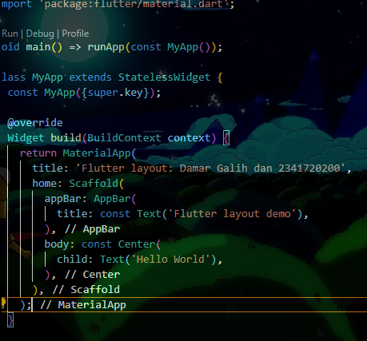
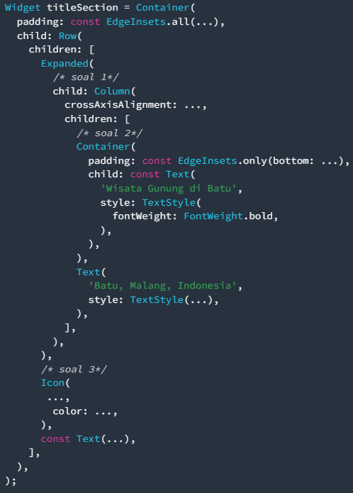
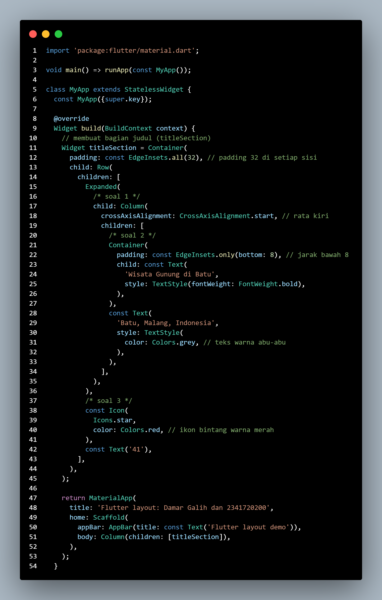
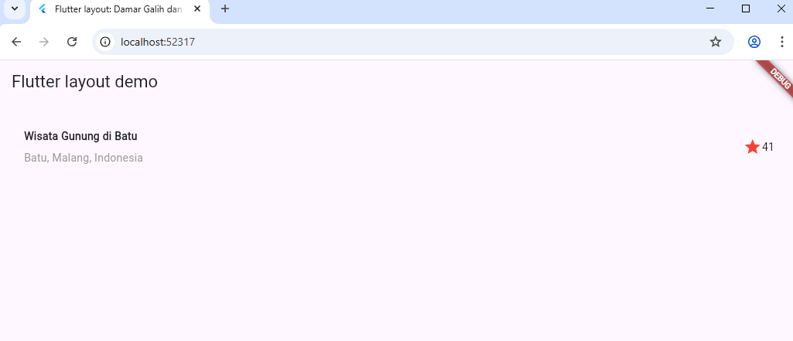
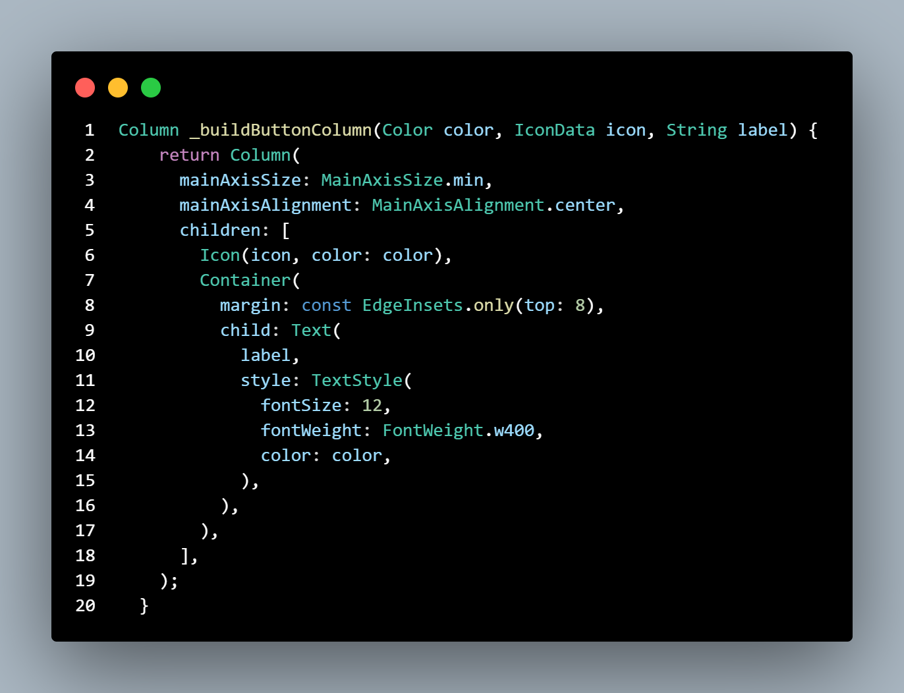
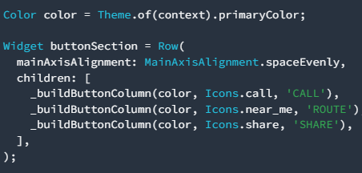
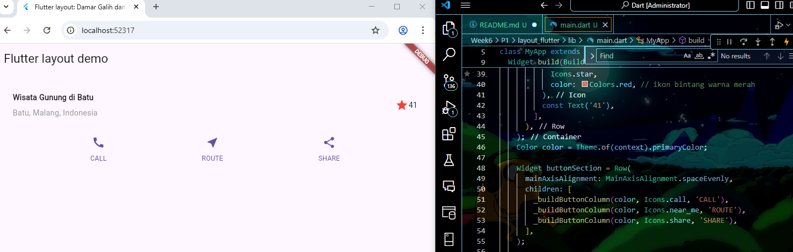
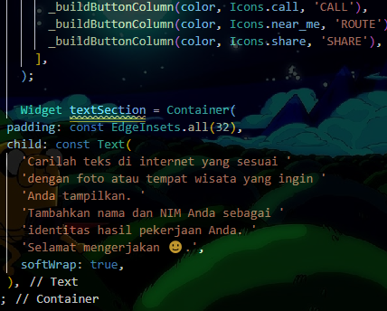
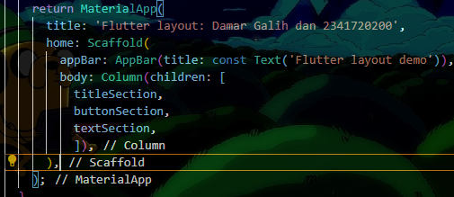

# Pemrograman Mobile Pertemuan 6

Codelabs 6 Layout dan navigasi

NIM : 2341720200

NAMA : Damar Galih Fitrianto

Praktikum 1 Membangun Layout di Flutter
# Langkah 1: Buat Project Baru

# Langkah 2: Buka file lib/main.dart

# Langkah 3: Identifikasi layout diagram

# Langkah 4: Implementasi title row

Praktikum 2 Implementasi button row

# Langkah 1: Buat method Column _buildButtonColumn

# Langkah 2: Buat widget buttonSection

# Langkah 3: Tambah button section ke body

Praktikum 3 Implementasi text section

# Langkah 1: Buat widget textSection

# Langkah 2: Tambahkan variabel text section ke body

Praktikum 4 Implementasi image section

# Langkah 1: Siapkan aset gambar

