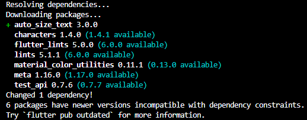
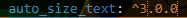
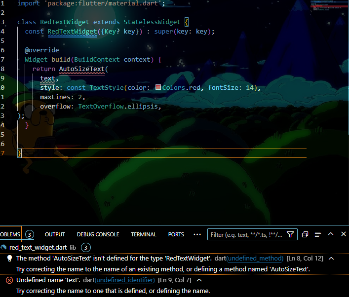
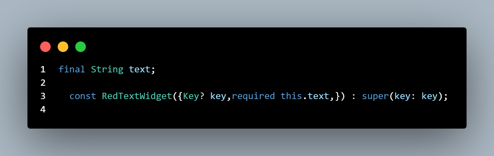
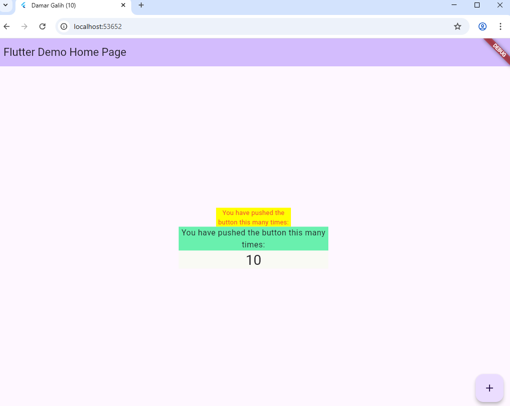

# Codelabs #07 Manajemen Plugin

Praktikum Lankah 2 

# Jelaskan maksud dari langkah 2 pada praktikum tersebut!

Fungsi flutter pub add auto_size_text adalah untuk menambahkan widget AutoSizeText ke proyek Flutter, yang memungkinkan teks secara otomatis menyesuaikan ukurannya agar pas dengan batasannya (misalnya, tinggi atau lebar tertentu) tanpa perhitungan manual.

Praktikum Lankah 4

Praktikum Lankah 5

# Jelaskan maksud dari langkah 5 pada praktikum tersebut!

widget tersebut harus menerima data dari widget induk (parent) yang memanggilnya, dan juga karena belum mendeklarasikan text sebagai properti (field) kelas.

yaitu 

final String text;

const RedTextWidget({Key? key, required this.text}) : super(key: key);

Praktikum Lankah 5

Praktikum Lankah 6

# Pada langkah 6 terdapat dua widget yang ditambahkan, jelaskan fungsi dan perbedaannya!

Container 1 (Warna Kuning)	Memberi latar belakang kuning (Colors.yellowAccent) dan membatasi lebar teks yang ada di dalamnya.	Menggunakan RedTextWidget yang di dalamnya terdapat AutoSizeText. Fungsi utamanya adalah memastikan teks dapat menyesuaikan ukuran hurufnya agar muat dalam lebar Container, serta menampilkan teks statis.

Container 2 (Warna Hijau)	Memberi latar belakang hijau (Colors.greenAccent) dan membatasi lebar teks.	Menggunakan widget Text standar (Text('$_counter')). Fungsi utamanya adalah menampilkan data dinamis pada aplikasi.

Perbedaan dari kedua container: Container pertama akan menyesuaikan ukuran font secara otomatis, sedangkan container kedua akan menampilkan text overflow jika terlalu panjang.

# Jelaskan maksud dari tiap parameter yang ada di dalam plugin auto_size_text

    **`text`** (parameter pertama):

     - **Fungsi**: String yang akan ditampilkan
     - **Tipe**: String (required)
     - **Contoh**: `'You have pushed the button this many times:'`

   - **`style`**:
     - **Fungsi**: Mengatur styling text seperti warna, ukuran font, font family, dll.
     - **Tipe**: TextStyle
     - **Contoh**: `TextStyle(color: Colors.red, fontSize: 14)`
     - **Note**: fontSize di sini adalah ukuran maksimum, akan diperkecil otomatis jika perlu

   - **`maxLines`**:

     - **Fungsi**: Membatasi jumlah baris maksimum yang dapat ditampilkan
     - **Tipe**: int
     - **Contoh**: `2` (maksimal 2 baris)
     - **Behavior**: Jika text terlalu panjang, akan dipotong sesuai maxLines

   - **`overflow`**:
     - **Fungsi**: Menentukan bagaimana menangani text yang melebihi batas
     - **Tipe**: TextOverflow
     - **Contoh**: `TextOverflow.ellipsis` (menambahkan "..." di akhir text yang terpotong)
     - **Opsi lain**: `TextOverflow.clip`, `TextOverflow.fade`, `TextOverflow.visible`

Kumpulkan laporan praktikum Anda berupa link repository GitHub kepada dosen!