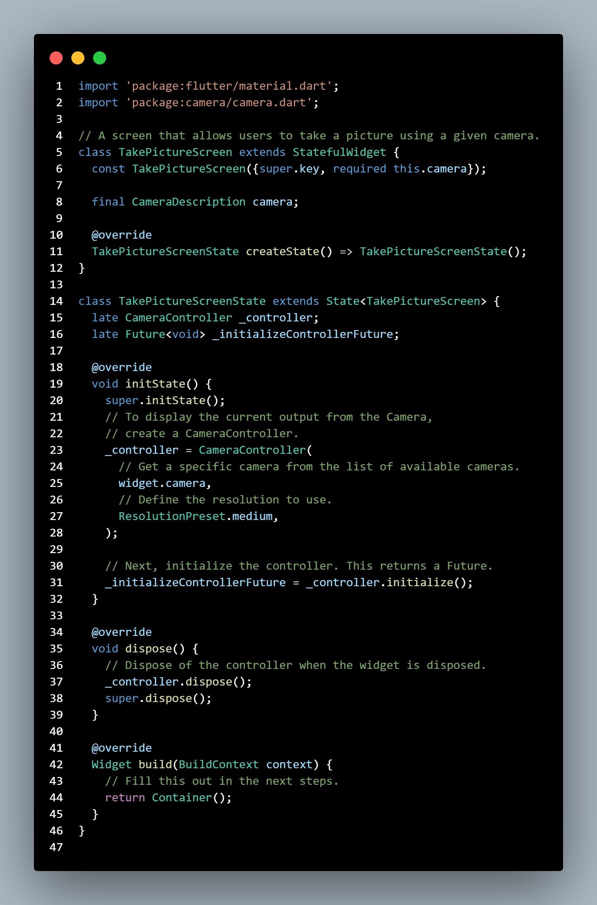
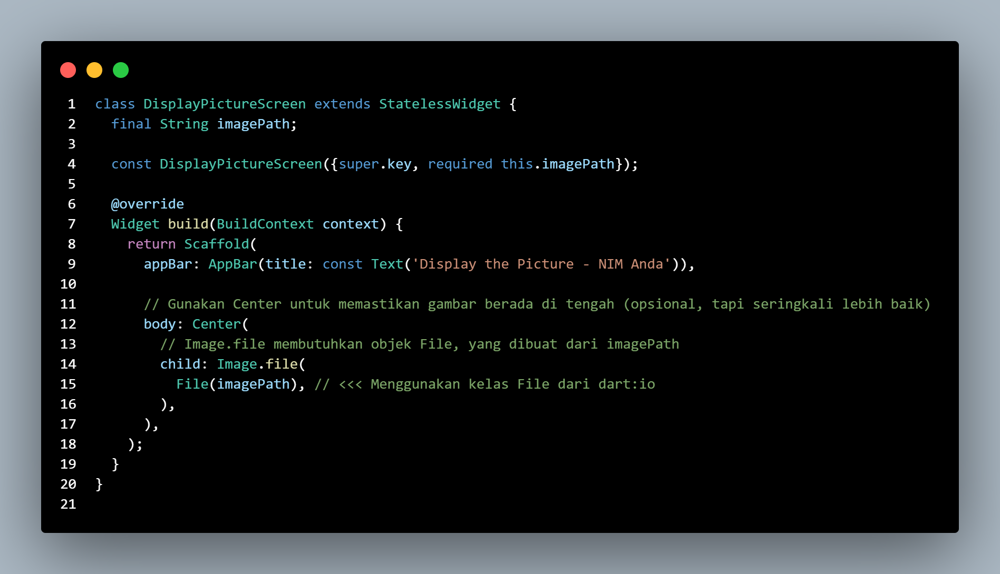
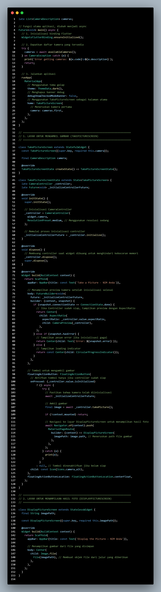
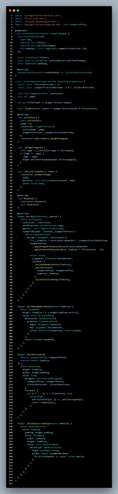
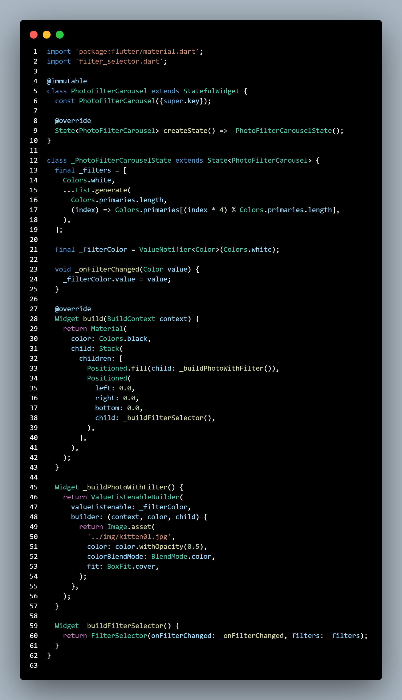
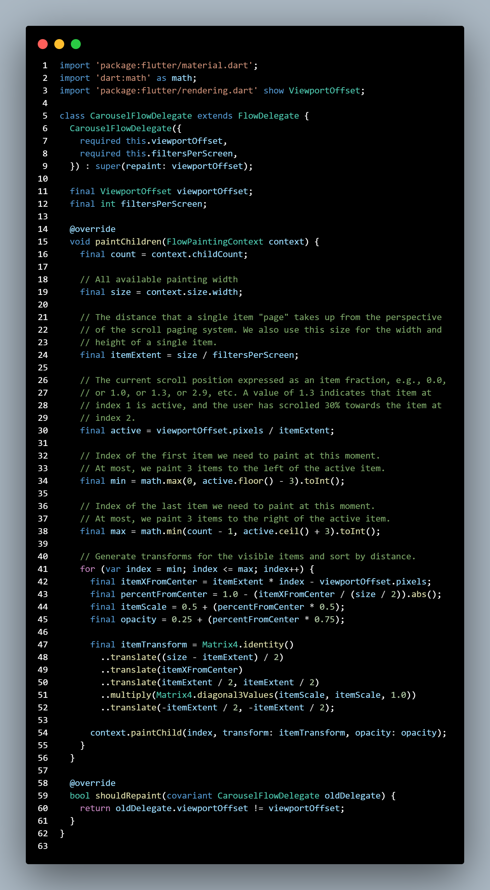
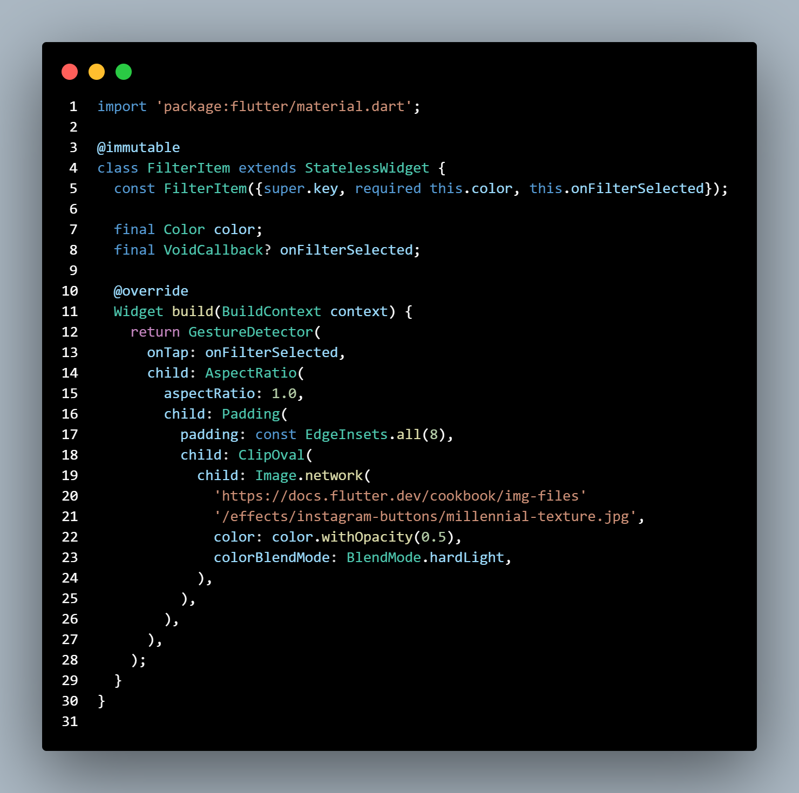
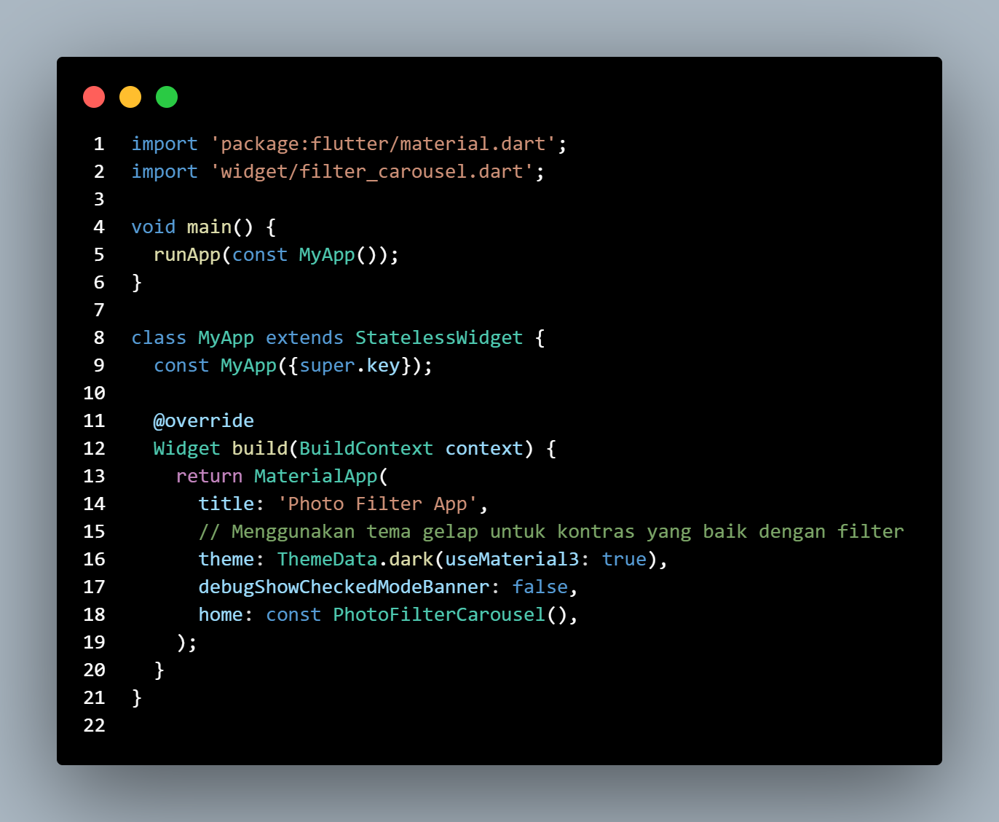
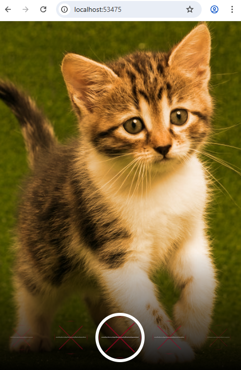

#  Codelabs #09 Flutter Camera & Photo Filter Projects

> **Nama Praktikan:** DAMAR GALIH FITRIANTO  
> **Kelas / NIM:**  3G & 2341720200  
> **Mata Kuliah:** Pemrograman Mobile
---
> **Dosen Pengampu:** Habibie Ed Dien

---

 [Deskripsi Umum](#deskripsi-umum)
Banyak aplikasi yang mengharuskan penggunaan kamera perangkat untuk mengambil foto dan video. Flutter menyediakan plugin kamera untuk tujuan ini. Plugin kamera menyediakan alat untuk mendapatkan daftar kamera yang tersedia, menampilkan pratinjau yang berasal dari kamera tertentu, dan mengambil foto atau video.

1. [Praktikum 1 - kamera_flutter](#praktikum1kamera_flutter)

    Ambil Sensor Kamera dari device
    

    Buat dan inisialisasi CameraController
    

    [displaypicture_screen.dart.png](#displaypicture_screen.dart.png)
    
    
    DisplayPictureScreen digunakan untuk menampilkan hasil foto yang diambil dari kamera. Kelas ini merupakan turunan dari StatelessWidget, artinya tampilannya tidak berubah setelah dibuat.

    Widget ini menerima satu parameter bernama imagePath, yaitu path (lokasi) file gambar yang dihasilkan dari proses pemotretan. Di dalam method build(), digunakan widget Scaffold untuk membangun struktur layar dengan AppBar sebagai judul dan body berisi widget Center agar gambar berada di tengah layar.

    Bagian utama tampilan gambar dibuat menggunakan Image.file(File(imagePath)), yang artinya Flutter akan membaca file gambar dari penyimpanan lokal menggunakan kelas File dari library dart:io, lalu menampilkannya di layar. Dengan begitu, setiap kali pengguna mengambil foto, hasilnya akan ditampilkan pada halaman ini secara penuh dan rapi di tengah layar.

    [takepicture_screen.dart.png](#takepicture_screen.dart.png)
    

    Di dalam TakePictureScreen, dibuat objek CameraController untuk mengatur kamera dan memulai proses inisialisasi agar kamera siap digunakan. 
    
    Setelah inisialisasi selesai, widget FutureBuilder akan menampilkan preview kamera secara langsung dengan CameraPreview(_controller). Jika kamera belum siap, aplikasi menampilkan loading indicator, dan jika gagal, menampilkan pesan error. Tersedia tombol FloatingActionButton bergambar ikon kamera untuk mengambil foto; tombol ini hanya aktif jika kamera sudah siap. Saat ditekan, kamera akan mengambil gambar menggunakan takePicture() dan hasilnya berupa path file gambar dikirim ke halaman DisplayPictureScreen melalui navigasi.

    [hasil.png](#hasil.png)
    
    

 1. [Praktikum 2 - photo_filter_carousel](#praktikum-2---photo_filter_carousel)

     Buat widget Selector ring dan dark gradient
    

    Kelas FilterSelector adalah StatefulWidget yang menampilkan deretan filter dalam bentuk carousel. Widget ini menerima tiga parameter utama:

    filters → daftar warna (atau efek filter) yang akan ditampilkan,

    onFilterChanged → callback yang dijalankan saat filter berubah,

    padding → jarak antar elemen carousel.

    Di dalam kelas _FilterSelectorState, digunakan PageController untuk mengatur posisi halaman dan animasi perpindahan filter.
    Metode _onPageChanged() memantau pergeseran halaman, lalu memanggil onFilterChanged untuk memberi tahu filter mana yang sedang aktif.
    Widget FilterItem (yang diimpor dari filter_item.dart) digunakan untuk menampilkan tiap item filter.

    Pada bagian build(), carousel dibuat menggunakan Scrollable dan Flow dengan CarouselFlowDelegate untuk menata elemen filter agar bisa digeser halus secara horizontal. Efek tambahan seperti bayangan gradien (_buildShadowGradient) dan cincin seleksi (_buildSelectionRing) ditambahkan agar tampilan filter lebih menarik dan menunjukkan filter yang sedang dipilih.

    Buat widget photo filter carousel
    

    Buat widget photo filter carousel
    

    Buat widget photo filter carousel
    

    Buat widget photo filter carousel
    

   [hasil.png](#hasil.png)
    

2. [Kesimpulan](#kesimpulan)
⚙️ Alur Kerja Program gabungan

## Inisialisasi Kamera
Program memanggil availableCameras() untuk mendeteksi kamera yang tersedia di perangkat.

Kamera pertama yang ditemukan digunakan oleh widget TakePictureScreen.

## Mengambil Gambar

Saat tombol kamera ditekan (FloatingActionButton), sistem akan memanggil _controller.takePicture().

Foto yang diambil disimpan sementara dan path-nya dikirim ke halaman filter.

Menampilkan Foto dengan Carousel Filter

Halaman PhotoFilterCarouselScreen membaca file gambar dari path yang dikirim.

Menggunakan package image untuk menerapkan berbagai efek seperti:

- Normal

- Grayscale

- Sepia

- Invert

- Emboss
3. [Jelaskan maksud void async pada praktikum 1?](#)

    async: Menandai fungsi main() agar dapat menjalankan operasi asinkron dan menggunakan kata kunci await.

    await: Digunakan untuk menunggu proses native mendapatkan daftar kamera (availableCameras()) selesai.

    Tujuan: Memastikan data kamera tersedia dan plugin WidgetsFlutterBinding.ensureInitialized() telah selesai diinisialisasi sebelum aplikasi (runApp) dijalankan, sehingga aplikasi tidak crash atau freeze (memblokir thread utama) saat berkomunikasi dengan sistem operasi.

4. [Jelaskan fungsi dari anotasi @immutable dan @override ?](#)

- @override
- - Fungsi Utama:
Digunakan untuk menandai bahwa suatu method (fungsi) atau property di kelas anak (subclass) dimaksudkan untuk menimpa (override) method atau property yang sudah ada di kelas induk (superclass) atau interface.

- - Manfaat:
Pengecekan Kompilator (Compiler Check): Jika Anda salah mengeja nama method atau salah memberikan parameter, kompilator akan segera memberikan error karena method yang Anda coba timpa tidak ditemukan di kelas induk. Ini mencegah bug sulit dilacak.

- - Kejelasan Kode: Membantu pengembang lain (atau diri Anda sendiri di masa depan) untuk mengetahui secara eksplisit bahwa method tersebut bukan method baru, melainkan implementasi ulang dari method yang diwarisi (misalnya, build(BuildContext context) yang menimpa build dari Widget).

- @immutable
- - Fungsi Utama:
@immutable adalah anotasi yang bersifat opsional dan merupakan bagian dari package meta di Dart. Anotasi ini digunakan untuk menandai sebuah kelas, biasanya widget (seperti StatelessWidget), sebagai kelas imutable (tidak dapat diubah).

- - Aturan yang Diberlakukan:
Ketika sebuah kelas ditandai sebagai @immutable, Anda harus memastikan bahwa semua field (variabel) di dalam kelas tersebut adalah:

    final (atau const). Ini adalah aturan terpenting.

    Tidak ada setter yang mengubah field tersebut.

- - Manfaat:
Jaminan Mutabilitas: Memberikan jaminan kepada pengembang dan alat analisis kode bahwa objek dari kelas tersebut tidak akan pernah berubah setelah dibuat (constructed).

    Mencegah Bug: Mencegah secara tidak sengaja menambahkan field non-final di masa depan, yang dapat menyebabkan bug atau ketidakkonsistenan state, terutama pada StatelessWidget.